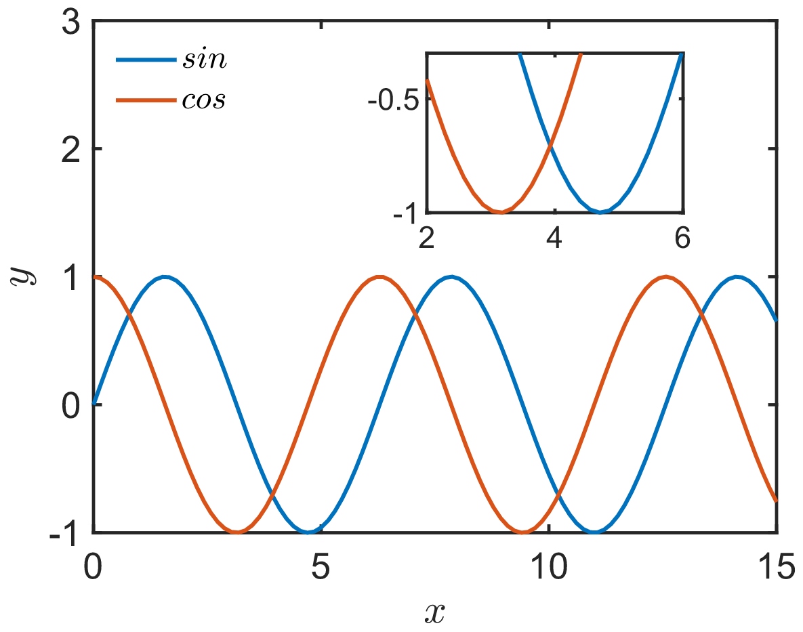

可以采用`axes`函数在当前图中插入一个小图的方法绘制局部放大图。
如下代码：

``` matlab
func = {@(x) sin(x), @(x) cos(x)};
x = linspace(0, 15);

figure;
ax1 = axes('Position', [0.11, 0.15, 0.8, 0.8]); % 主图
ax2 = axes('Position', [0.5, 0.65, 0.3, 0.25]); % 局部图

for i=1:length(func)
    plot(ax1, x, func{i}(x));
    hold(ax1, 'on');

    plot(ax2, x, func{i}(x));
    hold(ax2, 'on');
end

xlim(ax1, [0, 15])
ylim(ax1, [-1, 3])
xlabel(ax1, '$x$', 'Interpreter', 'latex');
ylabel(ax1, '$y$', 'Interpreter', 'latex');
legend(ax1, {'$sin$', '$cos$'}, 'Location', 'northwest', 'Interpreter', 'latex')

xlim(ax2, [2, 6])
ylim(ax2, [-1, -0.3])
```

输出：
<div align=center>

</div>
