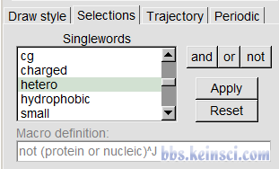
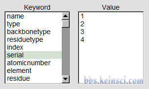

## **1 前言**

VMD（[http://www.ks.uiuc.edu/Research/vmd/](http://www.ks.uiuc.edu/Research/vmd/)）是极其强大、灵活的化学体系可视化程序，笔者之前也写过不少相关文章，见[http://sobereva.com/category/VMD/](http://sobereva.com/category/VMD/)。VMD的选择语句(selection)用来选择满足特定要求的体系中的原子，其用法极度简单灵活，对于VMD的使用至关重要。

选择语句在VMD里用的地方非常多，无处不在。比如如果想在图形窗口只显示指定的区域，那么可以在Graphics - Representation里在selected atoms的地方写上选择语句。如果想把指定的区域保存成新文件，那么可以在File - Save coordinates里在Selected atoms写上选择语句。很多自带的插件也需要选择语句，比如VMD自带的径向分布函数计算插件，里面selection 1、selection 2就是让你输入选择语句的地方。在VMD里还可以用atomselect命令创建对象，显然也要输入选择语句。顺带一提，如今GROMACS里也可以用selections语句，和VMD很大程度一致，但不完全一致。

鉴于经常有人问选择语句怎么用，每次回复很麻烦，笔者遂专门写个小文说一下。这些内容在“北京科音分子动力学与GROMACS培训班里”（[http://www.keinsci.com/workshop/KGMX_content.html](http://www.keinsci.com/workshop/KGMX_content.html)）里大多也都讲过，之前的学员可以复习一下。本文内容对应VMD 1.9.3。下文从简单到复杂进行讲解。

## **2 单关键词（Singleword）**

有一些关键词可以直接选择特定原子，以下举例一部分：

 all：所有原子

 none：不选择任何原子

 noh：氢以外的原子（即重原子）

 ion：离子

 water：水

 backbone：生物大分子骨架

 sidechain：生物大分子侧链

 protein：蛋白

 nucleic：核酸

 helix：螺旋

 alpha_helix：alpha螺旋（是helix中的子集，较长一段螺旋才算）

 sheet：折叠

 turn：转角

 coil：盘绕

 alpha：蛋白质的alpha碳

 acidic：PH=7时带负电氨基酸

 basic：PH=7时带正电氨基酸

 charged：acidic和basic的并集

 neutral：电中性氨基酸

 polar：极性残基

 hydrophobic：疏水性残基

 bonded：成键的原子

 hetero：非蛋白质和核酸的部分

 carbon、hydrogen、oxygen、nitrogen、sulfur：相应元素。对于其它元素没法这么输入元素名来选择

这些单关键词实际上可以在Representation界面里的Selections标签页里的Singlewords直接看到，可见可以用的单关键词远不止上述这些。有些单关键词其实是复合选择语句，比如你选中hetero，就会看到其定义其实是not (protein or nucleic)。

注意有些情况下，单关键词未必能如实选择相应的区域。比如你载入的结构里有水，如果输入文件里水的残基名很特殊，比如叫FFF，那么VMD就不会把这个残基识别成水分子，用water关键词的时候也没法选中这些水。

## **3 一般关键词**

用下面这些关键词可以通过属性选取原子，都是后面要接参数的

 name：原子名。例：name OW选择原子名叫OW的原子

 index：原子序号（从0开始！）。例：index 4

 serial：原子序号（从1开始）

 type：原子类型。例：type CA选择CA原则类型

 element：元素名。例：element P选择磷原子

 resname：残基名。例：resname ALA代表选择丙氨酸

 residue：残基编号，从0开始。例resid 372代表选择372号残基

 resid：残基编号，从1开始。若结构文件里有残基号则与之一致

 chain：链名。例：chain B代表选择B链

 fragment：片段编号。VMD对每个键连的片段自动设定一个编号。例：fragment 4代表选择片段4

 numbonds：成键数目。例：numbonds=2或numbonds 2代表选形成了两个键的原子

 structure：二级结构。例：structure H代表选择螺旋(helix)区域

 x,y,z：X/Y/Z笛卡尔坐标

 vx,vy,vz：X/Y/Z方向速度

 beta：pdb文件中的beta值

 occupancy：pdb文件中的原子占有率

 mass：原子质量

 charge：原子电荷

 phi、psi：蛋白质骨架角度

 radius：原子半径

...等等

每个属性后面能接什么值，在Selections标签页里都能看到，不确定的话看一眼便知：

许多属性并非对于任何输入文件都能用。比如：

·使用charge属性，必须输入的文件里体现了原子电荷才行，比如可以用mol2或pqr，后者详见《使用Multiwfn+VMD以原子着色方式表现原子电荷、自旋布居、电荷转移、简缩福井函数》（[http://sobereva.com/425](http://sobereva.com/425)）。

·使用beta属性，通常需要用pdb文件作为输入，因为里面专门有一列记录B因子信息。

·用type的话必须载入拓扑文件才行。

·用vx、vy、vz的话，对于GROMACS用户，参看《使VMD读入Gromacs产生的trr轨迹中速度信息的方法》（[http://sobereva.com/117](http://sobereva.com/117)）。

·element信息是很多文件里没有的，比如GROMACS的.gro文件里就没体现

## **4 选择语句中可利用的规则**

在选择语句中有以下规则可以利用，通过组合、嵌套，使得选择语句无比强大

·可以写多个参数一次选择一批，彼此间用空格分隔

·可以用... to ...选择特定范围

·可以用与、或、非这些逻辑关系：and、or、not

·可以用( )或{ }指定语句处理的优先顺序

·双引号内的字符会被视为整体，并且可以使用正则表达式

·用单引号扩住则里面的字符可以避免被转义

·可以用判断语句：<, <=, =, >=, >, !=

·可以用函数：sqr（平方）, sqrt（开根号）, abs（绝对值）, sin, cos, tan, atan, asin, acos, sinh, cosh, tanh, exp, log, log10

·支持运算符：+ - * /。可以用^或**来表示多少次方

·特殊选择方式：

 within 5 of AAA：距离AAA 5埃以内的原子。选取时不考虑周期边界条件，用pbwithin则考虑

 exwithin 5 of AAA ：同上，但不包含AAA自身

 withinbonds 2 of AAA：距离AAA不超过两个键的原子

 same p as AAA：与AAA选区的p属性相同的部分

 ringsize 5 from AAA：处于AAA中五元环上的原子

 maxringsize 6 from AAA：处于AAA中<=六元环的原子

下面来看一些具体例子

 index 5 to 200 210：序号在5~200内的原子以及210号原子

 protein or nucleic：蛋白质与核酸的原子

 resname ALA CYS ARG：丙氨酸、半胱氨酸、精氨酸原子

 backbone not helix：除了螺旋区域以外的骨架原子

 name CA CB 或 name "CA|CB" 或 name "C[AB]" 或 name "C(A|B)"：名为CA和CB的原子

 name "C."：名字为两个字符且第一个字符为C的原子

 name "CE[1-3]"：名字为CE1、CE2、CE3的原子

 name 'O5*'：叫O5*的原子。注意原子名带星号的在选取时要用单引号括住以免转义

 resname 'CA2+'：残基名是CA2+的原子（二价钙离子）。名字带正负号的也要用单引号括住以免转义

 mass > 5：质量大于5的原子

 abs(charge)>1：电荷大小超过1的原子

 x<6 and x>3：选择x在3~6埃区域内的一层原子

 x>1 and x<8 and y>24 and y<35 and z>1 and z<5：一个矩形区域内的原子

 sqr(x-5)+sqr(y+4)+sqr(z) < sqr(5) ：以(5,-4,0)点为中心半径5埃以内的原子

 ((x-33)^2+(y-14.5)^2)<12^2 and z<40 and z>10：选择以x=33、y=14.5埃为中心，半径为12埃，z范围在10~40埃的柱形区域

 x+y+z<80：斜切面内侧的原子（回忆平面方程）

 not {oxygen and numbonds=0}：扣除孤立的氧原子（可以用于去除X光衍射pdb文件里的结晶水）

 within 6 of protein：距离蛋白质6埃以内的原子

 not within 5 of resname ADP：距离名为ADP的分子5埃以外的原子

 water within 5 of residue 8 to 44：距离8~44号残基5埃以内的水

 withinbonds 2 of index 31：距离编号为31原子的两个键及以内的原子

 maxringsize 6 from protein：蛋白当中所有六元及六元以下环上的原子

 same resname as resid 33：所有与33号残基相同名称的残基

 same residue as {protein within 5 of nucleic}：与核酸的原子相距5埃以内的蛋白的原子，并且把被截断的残基保留完整

 x > 15 and not same fragment as {exwithin 8 of protein}：蛋白质以及蛋白质8埃范围以外的原子，保留完整片段，同时x坐标得大于15埃

以上例子中，涉及到坐标、速度变量的，属于动态选区，即随着帧号变化被选择的原子会可能发生变化。观看这些选区的时候，注意在Representation界面的Trajectory标签页里要把Update Selection Every Frame选上，否则选中的原子是对刚选中时那一帧而言的，不会随着轨迹播放被动态更新。在一些VMD的插件中，比如计算rdf的Radial Pair Distribution Function g(r)插件里，当Selection文本框里用了动态选区时，应当把Update Selections复选框选上，否则也由于不会被动态更新而和期望的不符。

> 转自 http://bbs.keinsci.com/thread-14267-1-1.html