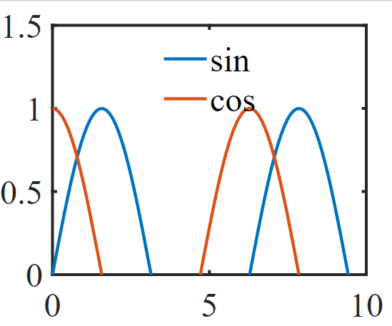
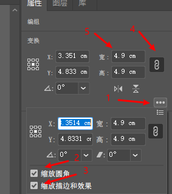
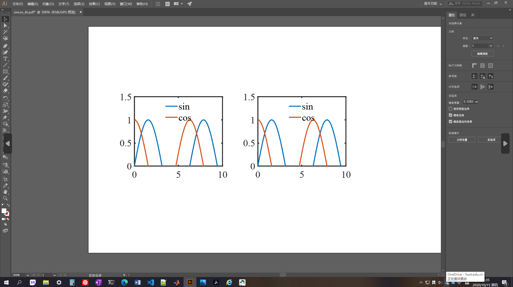
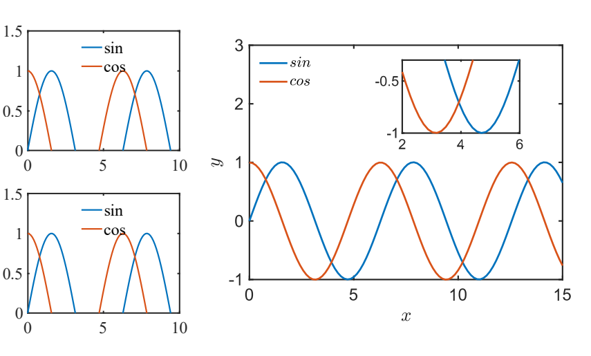

## 如何生成高质量论文矢量图

### 1. 在Matlab中指定图片大小，字体大小，并导出为`svg`格式的矢量图

```matlab
x = linspace(0, 10);
y1 = sin(x);
y2 = cos(x);

% 图片大小为 10cm X 8cm
fig = figure('Position', [2, 2, 10, 8], 'Units', 'centimeters'); 

plot(x, y1, 'DisplayName', 'sin')
hold on
plot(x, y2, 'DisplayName', 'cos')

ylim([0, 1.5])
legend('Location', 'north');

print(fig, 'sincos.svg', '-r300', '-dsvg'); % 输出为 svg 格式
```


### 2. 打开AI (Adobe illustrator)，新建，设置图纸大小（16cm X 10cm）


### 3. 插入Matlab导出的`svg`文件（`文件`->`置入`，快捷键为`Ctrl+Shift+P`）

### 4. 调整图片大小
   
   插入到AI中的图片可能会很大，这时就要对图片进行缩放，可以用鼠标进行缩放，如果要保证横纵缩放比例一致，需要按住`Shift`键。用鼠标缩放可能会导致字体大小不一致，这时需要输入具体数值改变图片大小，输入的数值需要与Matlab中设定的图片大小一致，可能缩放过后线条的粗细没变，这时需要设置`缩放描边和效果`

   

   

### 5. 从AI中输出高质量矢量图

文件->存储为，可以保存为`pdf`或`eps`等矢量图格式


