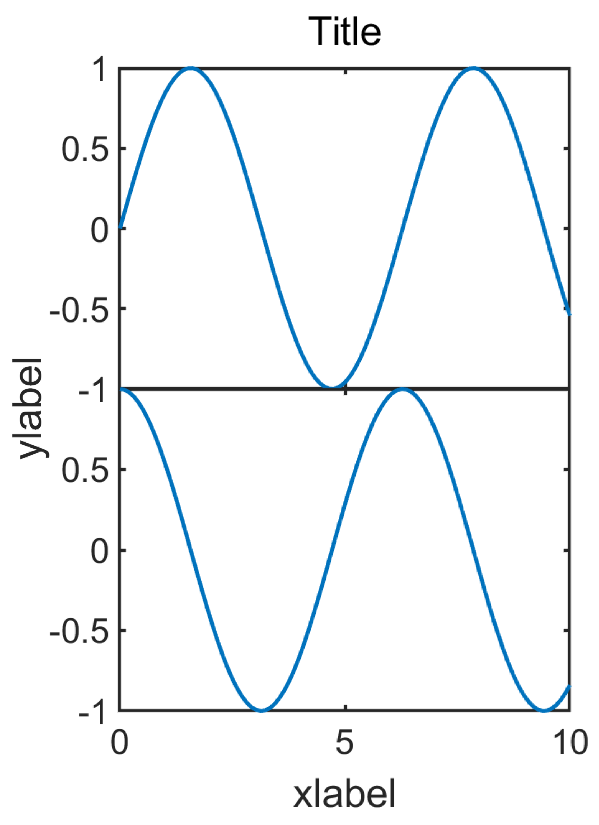

## 前言
我们在用Matlab的`subplot`函数绘制图组时可能会发现子图之间的间距不太好看，可以通过`set('Position', [l, b, w, h])`函数来分别调整，比较麻烦，这里我写了一个函数`subplot_adjust`来简化这一过程。

## 用法
function `subplots_adjust(row, col, varargin)`

Tune the subplot layout.
  
The parameter meanings (and suggested defaults) are
  
    left = 0.12    # the left side of the subplots of the figure
    bottom = 0.138 # the bottom of the subplots of the figure
    width = 0.8    # the width of the subplots of the figure
    hight = 0.78   # the hight of the subplots of the figure
    wspace = 0.12  # the amount of width reserved for space between subplots,
                   # expressed as a fraction of the average axis width
    hspace = 0.1   # the amount of height reserved for space between subplots,
                   # expressed as a fraction of the average axis height
    supPosition = [0.075, 0.08, 0.9, 0.85] 
                   # [left, bottom, width, hight]
                   # super axes position, which controls position of
                   # supxlabel, supylabel and suptitle.

在用`subplot`画完图组后，直接在最后面加上`subplot_adjust`即可，例如：
``` matlab
x = linspace(0, 10);
y1 = sin(x);
y2 = cos(x);
figure('Position', [10, 50, 400, 550]);
subplot(2, 1, 1)
plot(x, y1)
subplot(2, 1, 2)
plot(x, y2)
ax = subplots_adjust(2, 1, 'hspace', 0, 'left', 0.2, ...
                    'width', 0.75, 'supPosition', [0.1, 0.08, 0.95, 0.85]);
xlabel(ax, 'xlabel')
ylabel(ax, 'ylabel')
title(ax, 'Title')
```
绘制2行1列图组，设置两子图之间纵向间距为0，结果如下：

<div align=center>

</div>

## 源码
``` matlab
function ax = subplots_adjust(row, col, varargin)
%% function subplots_adjust(row, col, varargin)
% Tune the subplot layout.
% 
% The parameter meanings (and suggested defaults) are::
% 
%   left = 0.12    # the left side of the subplots of the figure
%   bottom = 0.138 # the bottom of the subplots of the figure
%   width = 0.8    # the width of the subplots of the figure
%   hight = 0.78   # the hight of the subplots of the figure
%   wspace = 0.12  # the amount of width reserved for space between subplots,
%                  # expressed as a fraction of the average axis width
%   hspace = 0.1   # the amount of height reserved for space between subplots,
%                  # expressed as a fraction of the average axis height
%   supPosition = [0.075, 0.08, 0.9, 0.85] 
%                  # [left, bottom, width, hight]
%                  # super axes position, which controls position of
%                  # supxlabel, supylabel and suptitle.
%
% Example:
% x = linspace(0, 10);
% y1 = sin(x);
% y2 = cos(x);
% figure('Position', [10, 50, 400, 550]);
% subplot(2, 1, 1)
% plot(x, y1)
% subplot(2, 1, 2)
% plot(x, y2)
% ax = subplots_adjust(2, 1, 'hspace', 0, 'left', 0.2, ...
%                      'width', 0.75, 'supPosition', [0.1, 0.08, 0.95, 0.85]);
% xlabel(ax, 'xlabel')
% ylabel(ax, 'ylabel')
% title(ax, 'Title')

p = inputParser;
addRequired(p, 'row');
addRequired(p, 'col');
addParameter(p, 'wspace', 0.12);
addParameter(p, 'hspace', 0.1);
addParameter(p, 'left', 0.12);
addParameter(p, 'bottom', 0.138);
addParameter(p, 'width', 0.8);
addParameter(p, 'hight', 0.78);
addParameter(p, 'supPosition', [0.075, 0.08, 0.9, 0.85]);
parse(p, row, col, varargin{:});

left   = p.Results.left;
bottom = p.Results.bottom;
width  = p.Results.width;
hight  = p.Results.hight;

space = [p.Results.wspace, p.Results.hspace];

eachx = (width-(col-1)*space(1)) / col;
eachy = (hight-(row-1)*space(2)) / row;
for i=1:row
    for j=1:col
        h = subplot(row, col, (i-1)*col+j);
        set(h, 'position', [left+(j-1)*(eachx+space(1)), bottom+(row-i)*(eachy+space(2)), eachx, eachy]);
        if j ~= 1 && space(1) == 0
            set(h, 'YTickLabel', {});
        end
        if i ~= row && space(2) == 0
            set(h, 'XTickLabel', {});
        end
    end
end

ax = axes('Units', 'Normal', 'Position', p.Results.supPosition, 'Visible', 'off');
ax.XTickLabel = {};
ax.YTickLabel = {};
ax.XLabel.Visible = 'on';
ax.YLabel.Visible = 'on';
ax.Title.Visible = 'on';

end
```

